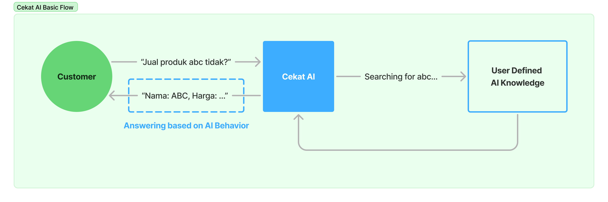
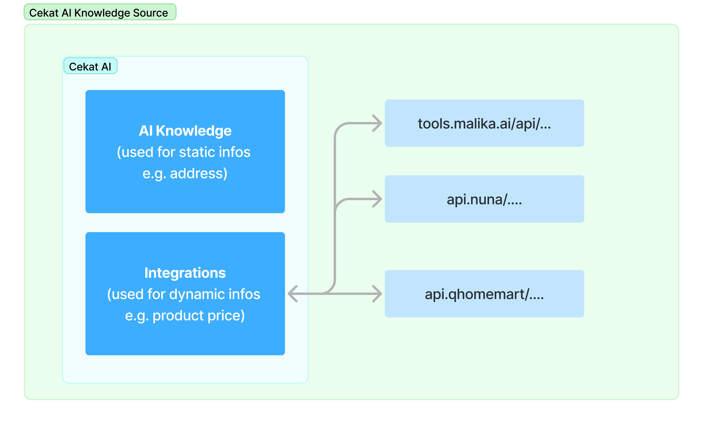
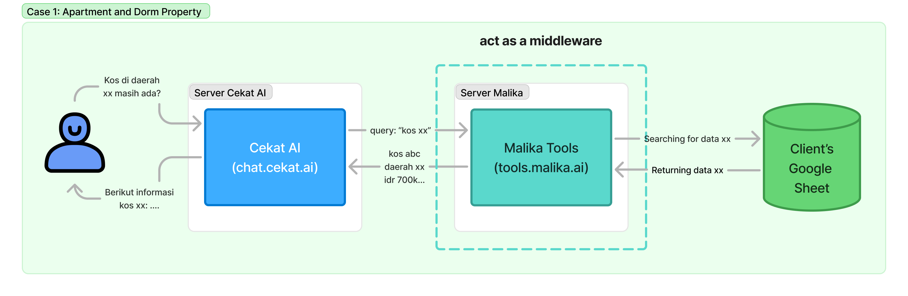
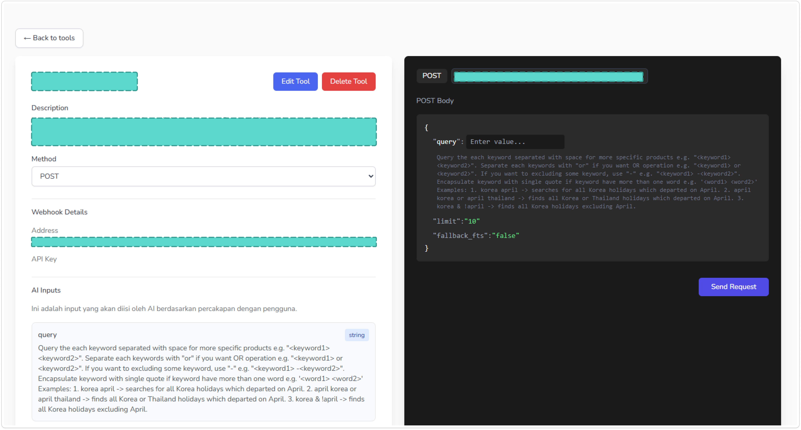
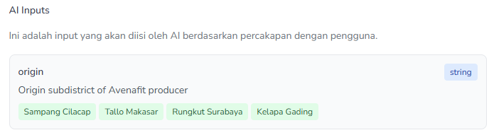

import { Aside } from '@astrojs/starlight/components';

Cekat AI adalah platform kecerdasan buatan yang dirancang untuk meningkatkan interaksi antara bisnis dan pelanggan melalui agen AI yang mampu berkomunikasi secara natural dan memahami konteks percakapan. Dikembangkan oleh Matthew Sebastian dan Nicholas Alden Liem, Cekat AI bertujuan memberikan solusi layanan pelanggan yang efisien dan responsif.

Cekat AI pake _Natural Language Processing_ (NLP) sebagai algoritma utama untuk ngeproses dan mahamin pesan-pesan teks yang diminta oleh customer melalui berbagai _connected platforms_, seperti WhatsApp, Instagram, atau Live Chat. Pesan-pesan yang diproses tersebut akan dipahami oleh si AI, lalu dikembaliin respon sesuai dengan yang diminta si customer, seperti menanyakan katalog, membaca _invoice_, melakukan _upselling_, dan lain sebagainya.


<p style="text-align:center;">Alur Umum Customer ke Cekat AI</p>

## About Cekat and The Root Issue

Sebenernya, fungsionalitas bawaan dari Cekat AI udah cukup banget buat ngebantu tim _sales_ ngejalanin proses-proses penjualan dari bisnis yang ditentukan. Namun, semakin besar bisnis, proses pendataan data di dalemnya juga ikutan kompleks. AI Knowledge yang bisa ditulis di dalam CRM Cekat AI gak akan cukup untuk meng-_cover_ keseluruhan data barang yang hendak dimuat sama klien. Selain banyak dan besar, data yang disimpan dinamis banget terutama data terkait harga dan katalog. Selain itu, terdapat data dari klien yang disimpan di platform-platoform yang berbeda, seperti API baik REST ataupun GraphQL, Google Sheet, dan lain sebagainya yang makin nyusahin kita kalo semata-mata cuma ngandelin AI Knowledge. Cekat AI juga belum bisa melakukan fitur-fitur klien unik bin aneh lain seperti _scheduling_ menggunakan Cron Job, pake API-nya si Raja Ongkir, perhitungan total harga yang kompleks dan ekstensi ke _third parties_ yang lainnya.

Untungnya, Cekat AI punya fitur Integrations yang dapat ngetranslasi pesan-pesan yang dikirim _customer_ menjadi HTTP request ke sebuah _endpoint_ API (Lihat selengkapnya tentang [HTTP, Middleware, dll](#what-is-middleware-actually)). Dengan fleksibilitas tersebut, kita dapat ngembangin sebuah _tools_ baru terhadap fungsi-fungsi yang tidak bisa diselesaikan oleh AI. Kita dapat membuat _tools_ untuk melakukan koneksi ke Google Sheet atau ke penyimpanan _third party_ yang lain, membuat fungsi _custom_ untuk menjumlah totalan harga, menggunakan API tertentu, dan lain sebagainya. Untuk itu, perkenalkanlah: **Malika Tools ✨**.


<p style="text-align:center;">Sumber <em>Knowledge</em> Cekat AI</p>

Gampangnya, Malika Tools itu _middleware_ (atau bisa juga disebut _webhook_/API/_backend server_) yang dijadiin "jembatan penghubung" antara Cekat AI dan klien. Malika Tools ini punya tujuan untuk mengintegrasikan berbagai data klien yang punya format dan platform macem-macem biar bisa "dibaca" oleh Cekat AI, tanpa harus masukin informasi data tersebut ke AI Knowledge secara manual. Seperti layaknya _middleware_, Cekat AI akan nglakuin _request_ HTTP ke Malika Tools melalui fitur Integrations yang disediakan (`_client to server_) dan Malika Tools akan mencari data yang sesuai ke pihak klien lalu mengembalikan hasilnya ke Cekat AI (_server to client_). Untuk lebih jelasnya tentang _middleware_, dapat dipantau-pantau di [HTTP, Middleware, dll](#what-is-middleware-actually)

<Aside type="note">

#### "Bahasa Bayi" about Cekat AI

Intinya, Cekat AI tuh punya dua "sumber pengetahuan" yang bisa diambil:
1. **AI Knowledge** ➡️ Statis dan internal (ditulis langsung di dalem CRM), berbasis teks atau paragraf, dan gak bisa akomodir data yang dinamis (karena ditulis manual).
2. **Integrations** ➡️ Dinamis dan eksternal (masukin link API ke CRM), bisa akomodir data dinamis karena data di-_supply_ dari pihak eksternal, skemanya Cekat AI request data tertentu -> pihak eksternal ngembaliin datanya.

Pihak eksternal yang ada di **Integrations** ini macem-macem, bisa dilewatin API si Malika Tools, atau langsung nge-_hit_ API klien langsung, kek Nuna atau QHomeMart (meskipun kebanyakan kasus di Malika, pake _tools_ kita sendiri _which is_ Malika Tools). 

</Aside>

## What is Middleware Actually? 

Sebelum jauh menyelami tentang istilah-istilah aneh: _middleware_, _webhook_, API, dll, _better_ mimin jelasin dulu konsep internet, web, dan aplikasi secara umum dulu ya!

Sejauh ini, udah jutaan bahkan milyaran aplikasi web yang terdaftar di internet, baik web-web receh buat portfolio yang biasanya cuma diakses sama kita-kita doang sampe web-web mahahebat milik Unicorn kayak Gojek atau Tokopedia yang udah nglakuin jutaan transaksi bersamaan dari ribuan _user_ tanpa ngelag. Aplikasi-aplikasi web ini umumnya dijalanin di sebuah entitas bernama **server**. Kalau diamati secara lebih dalem, si server-server ini sebenernya ya cuma komputer seperti yang kita punya pada umumnya, tapi tugasnya spesifik digunain buat nyediain konten-konten aplikasi web yang bisa diakses di seluruh dunia. Si aplikasi web yang berjalan di atas server ini umumnya bisa kamu akses dengan ngetik alamat web atau URL tertentu (biasanya diawali http:// atau https://), misal https://tools.malika.ai. 

Nah, kalo _middleware_ itu adalah istilah yang bisa diibaratin sebagai jembatan yang menghubungkan berbagai aplikasi atau sistem dalam dunia teknologi, baik aplikasi web atau sistem yang lain. Mimin bisa bantu bayangin kalo _middleware_ itu ya sebuah aplikasi yang duduk berjalan di sebuah sistem operasi di dalam komputer sama kek aplikasi web yang lain, tapi kerjanya spesifik buat sebagai perantara, "pintu masuk", atau jembatan penghubung dari sistem ke sistem. Meskipun sebenernya _middleware_ _term_-nya lebih luas daripada itu (alias gak melulu tentang aplikasi web), tapi biar gampang, middleware intinya adalah aplikasi (umumnya aplikasi web) yang kerjanya ngehubungin berbagai sistem atau aplikasi lain yang berbeda-beda dengan protokol dan cara komunikasi yang standar.

##### Nah terus apa dong ngaruhnya sama Cekat AI dan Malika Tools?

Seperti yang udah dijelasin sebelumnya, Malika Tools ini bisa dibilang sebuah _middleware_ (atau aplikasi penghubung) antara Cekat AI (aplikasi web juga) ke data klien, yang mana bentuk dan formatnya macem-macem. Malika Tools ini bertindak sebagai "mesin pencari" dari _request_ _user_ ke data klien yang disambungkan ke Malika Tools. Biar lebih jelas, kita kasih contoh sebuah kasus berikut.

<Aside>

#### Case 1: Apartment and Dorm Property

Sebuah perusahaan klien memiliki usaha di bidang properti, utamanya pada sewa kos dan apartemen. Perusahaan tersebut memiliki data katalog kos dan apartemen yang sangat dinamis mengenai availibility dan harga dari kos atau apartemen yang disewakan. Data yang cepat berubah tersebut akan sangat menyulitkan apabila harus dimasukkan ke AI Knowledge yang harus ditulis dalam bentuk teks manual dan sesuai format prompting, sehingga data dimuat ke penyimpanan terpisah seperti Google Sheet dan klien bertanggung jawab terhadap data di dalam Google Sheet tersebut.


<p style="text-align:center;">Peran Malika Tools</p>

</Aside>

Pertanyaan selanjutnya yang mungkin kebayang..
 
> **Kenapa kudu repot-repot lewat Malika Tools? Kenapa gak langsung dari Cekat AI aja dari AI Knowledge?**

Jawabannya adalah:
1. Seperti yang udah dijelasin, karena datanya dinamis dan cepet berubah, mindah satu2 data baru ke AI Knowledge akan sangat _tedious_ dan melelahkan
2. Cekat AI secara langsung belum punya fitur _connector_ ke data dari berbagai platform seperti Google Sheet atau yang lainnya, jadi diperluin _tools_ khusus untuk meng-_handle_ itu semua, yakni si _middleware_ Malika Tools ini


### What about API or Webhook? Are They Interchangeable?

Meskipun sebenernya terdapat perbedaan definisi secara teknis, baik API, webhook, atau middleware sebenernya punya tujuan yang sama: ngegabungin dan ngeintegrasi berbagai sistem atau aplikasi agar bersatu padu dan bisa bekerja sama satu sama lain. Biar lebih nambah ilmu tentang istilah-istilah itu, mimin bantu analogikan dengan poin-poin di bawah ya!

##### Application Programming Interface (API)
API itu jembatan komunikasi antar aplikasi. Misal, kamu buka aplikasi ojek online dan pengen tau lokasi driver, tuh aplikasi gak bisa langsung baca data GPS-nya driver, dia harus “ngobrol” dulu via API. Intinya: API = alat buat minta atau ngasih info antar sistem. Kalo kamu udah baca2 tentang _middleware_ sebelumnya, sebenernya ini hampir mirip cuma kalo istilah API dipakai ke hal-hal yang lebih _general_ dan luas, tidak terbatas pada aplikasi web aja.

##### Webhook 
_Webhook_ itu notifikasi otomatis dari server ke aplikasi atau server lain pas ada suatu kejadian atau _trigger_. Webhook ini bisa dibilang versi lebih _advanced_-nya dari API biasa, yang mana kalo API biasa kamu harus minta secara spesifik baru dikasih (_request-response communication_), sementara di _webhook_, kamu bisa dapet data atau respons dari _trigger_ atas suatu _event_ dari aplikasi yang bersangkutan. _Trigger_ atau _event_-nya bisa macem-macem, misal ketika user menyelesaikan transaksi, melakukan proses tertentu, dll dan biasanya implementasinya spesifik di aplikasi masing-masing.

Istilah _webhook_ ini dipake Cekat AI di bagian fitur Integrations-nya, karena dia akan ngasih data ke aplikasi lain pakai _trigger_ atau kejadian dari pesan-pesan _user_. Kalau kita lihat contoh di [Case 1: Apartment and Dorm Property](#case-1-apartment-and-dorm-property), _request_ dari Cekat AI ke Malika Tools `query: "kos xx"` bernama _**webhook**_, di mana di-_trigger_ ketika user mengirim pesan dengan kata kunci tertentu seputar nanyain produk xx.

##### Middleware
Sama kek API, cuma dia lebih ke spesifik aplikasi web atau servernya, kalo definisi API lebih general: bisa aplikasi, bisa cara komunikasinya, dan lainnya.

## Cekat API Integration

Setelah cukup ngerti tentang webhook, API, middleware, dan aplikasi web, _then_, gimana sih cara nggunain si Cekat API Integration ini? Seperti yang mimin tulis sebelumnya, Cekat API Integration ini merupakan salah satu jalan yang bisa dipake buat komunikasi dengan sistem, aplikasi, atau data di luar sana, yang mana **cara komunikasinya berbasis API** lalu API itu dipanggil pake **webhook**. Akan tetapi, untuk ke depan, mimin sepakati bahwa webhook-webhook atau API-API yang didaftarin di Integrations dengan sebutan ⚙️**tools**⚙️. _So_, biar ga bingung, kita coba telusuri tampilan menu Integrations ini yaaa 👇


<p style="text-align:center;">Tampilan Salah Satu Tools di Integrations</p>

### Name and Description

Kamu bisa ngasih nama dan deskripsi spesifik buat _tools_ yang kamu bikin. Better deskripsi ditulis pakai bahasa inggris dan dikasih trigger-trigger apa aja yang bisa AI lakuin, misal "_call this tools whenever user is asking about product price_"

### Method

Umumnya menggunakan `POST` alih-alih `GET` 

### Address

_Address_ adalah alamat URL dari aplikasi atau sistem lain yang akan kita kirimin _payload_ atau _request_ yang kita definisikan di AI Inputs ([Lihat AI Inputs](#ai-inputs)) atau Additional Payload ([Lihat Additional Payload](#additional-payload)). Untuk Malika Tools, setiap fitur memiliki _address_ URL yang berbeda-beda, misal untuk fungsi searching data, terletak di https://tools.malika.ai/api/search. Kamu juga bisa ngemasukin _address_ lain apabila klien punya API server sendiri dalam ngelola dan ngasih data mereka.

<Aside type="danger">

##### Each address has its inputs!

Setiap _address_ memiliki input yang bersesuaian atau berbeda. Seperti contohnya untuk fungsi _searching_, terdapat input wajib yaitu `query` bertipe teks/string dan `limit` bertipe number. Untuk fungsi _custom function_

Untuk fitur apa saja yang ada di Malika Tools beserta address dan input-nya, kamu bisa mampir di bagian selanjutnya tentang [Malika Tools](/general/malika-tools/)


</Aside>

### API Key

Berisi API Key dari API atau sistem lain yang didaftarin ke tools. Setiap API biasanya ada dokumentasi yang ngehandel terkait autentikasi dan autorisasi. Namun, Malika Tools untuk saat ini tidak perlu memerlukan API Key di _tools_-nya 

### Inputs

Terdapat dua input yang bisa dikirim ke tools, yaitu yang bersifat dinamis dari AI (AI Inputs) dan statis (Additional Payload). Adapun format dari input ini berbasis JSON Object 


```javascript
// JSON Example
{
    'query': 'product xxx',
    'limit': 10, 
}
```

#### AI Inputs

AI Inputs adalah jenis input data yang akan dikirim berdasarkan _trigger_ tertentu dari pesan yang dibaca oleh si AI ke _address_ yang didaftarin. Karena itu, isi dari AI Inputs akan dinamis mengikuti sesuatu apa yang user tanyakan mengenai produk atau jasa. Perlu diingat, setiap _address_ mempunyai input yang berbeda-beda. Dengan demikian, perlu diperhatikan bahwa input yang diberikan ke address tertentu harus sesuai (untuk input di setiap fitur Malika Tools, dapat dilihat di [Malika Tools](/general/malika-tools/)).

Meskipun dinamis, AI Inputs ini juga bisa kita batasi menggunakan fitur di Integrations bernama **Enum**, di mana kita membatasi _value-value_ yang diberikan ke tools untuk tiap spesifik input tertentu. Seperti gambar di bawah, AI hanya bisa mengisikan input `query` dengan 4 nilai saja: `Sampang Cilacap`, `Tallo Makasar`, `Rungkut Surabaya`, dan `Kelapa Gading`.


<p style="text-align:center;">Enum dari AI Inputs</p>

#### Additional Payload

Input ini kurang lebih sama dengan AI Inputs, tapi berisi nilai statis yang didefinisiin ketika ngebuat atau mengedit informasi tentang tools. Biasanya dipakai untuk input-input yang statis seperti `limit` yang ditentukan nilainya secara spesifik (misal `10` yang berarti hanya mengembalikan data dengan jumlah 10 _rows_) 

<Aside type="note">

#### Input Example

Kamu nyediain AI Inputs untuk address Malika Tools pada fitur _searching_ berupa `query`. Habis itu, kamu nyediain Additional Payload berupa `limit` dan `fallback_fts`. Maka nanti format JSON yang dikirimkan ke API Malika Tools dari Cekat AI adalah sebagai berikut:

```javascript
{
    'query': 'product xxx', // Dinamis diisi oleh AI
    'limit': 10, // Statis
    'fallback_fts': true, // Statis
}
```

Untuk fitur apa saja yang ada di Malika Tools beserta address dan input-nya, kamu bisa mampir di bagian selanjutnya tentang [Malika Tools](/general/malika-tools/)

</Aside>

## How Cekat AI's Tool Could Seamlessly Works with Malika Tools v2 API Together?

Berkat fitur Integrations ini, kapabilitas Cekat AI buat nglakuin integrasi ke sistem-sistem lain jadi lebih gampang dan fleksibel. Dengan ngemanfaatin fitur ini, tim Malika nyoba untuk ngembangin sebuah _middleware_ yang berkomunikasi dengan basis API dan _webhook_ untuk menyempurnakan proses-proses bisnis yang kian hari makin dinamis dan kompleks dari tiap-tiap klien, terutama yang ada hubungannya sama data katalog dan lain sebagainya. Sampe sekarang, Malika Tools telah berhasil ngembangin beberapa fitur utama antara lain
1. **Search** ➡️ Digunain buat ngeintegrasiin Malika Tools dengan data dari pihak klien dengan platform yang macem-macem
2. **Cek Ongkir** ➡️ Pake API Raja Ongkir buat ngecek ongkir tapi input alamatnya jauh lebih simpel dan fleksibel
3. **Custom Function** ➡️ Nglengkapin _edge cases_ yang tidak tercakup dari fitur-fitur di atas tapi tetep modular dan scalable, misal buat perhitungan total harga dengan kombinasi cek ongkir dan lain sebagainya
4. dan _upcoming features_ yang lain seperti _scheduler_, _invoice generator_, dan lain sebagainya.


Nantinya, Malika Tools akan terus dikembangkan dengan ditambah fitur-fitur baru yang terkait dengan klien, serta melakukan optimasi agar kinerja dari sisi teknisnya jauh lebih efisien. So, untuk penjelasan tentang Malika Tools, bisa lanjut ke bagian berikutnya ya!
