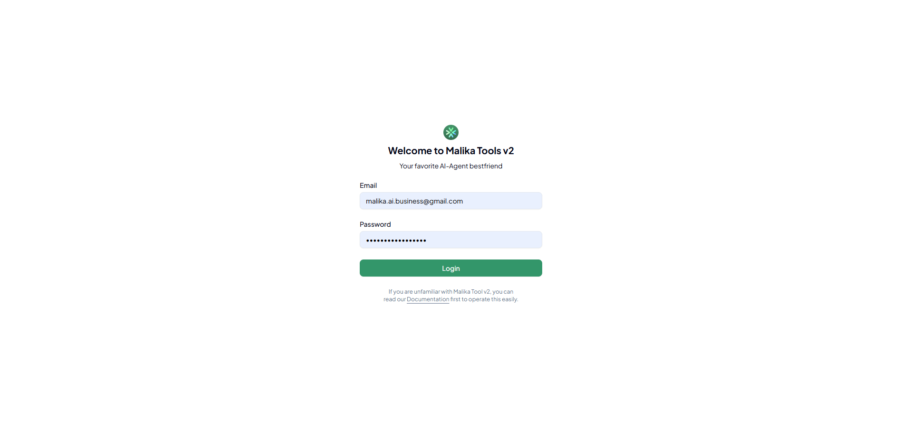
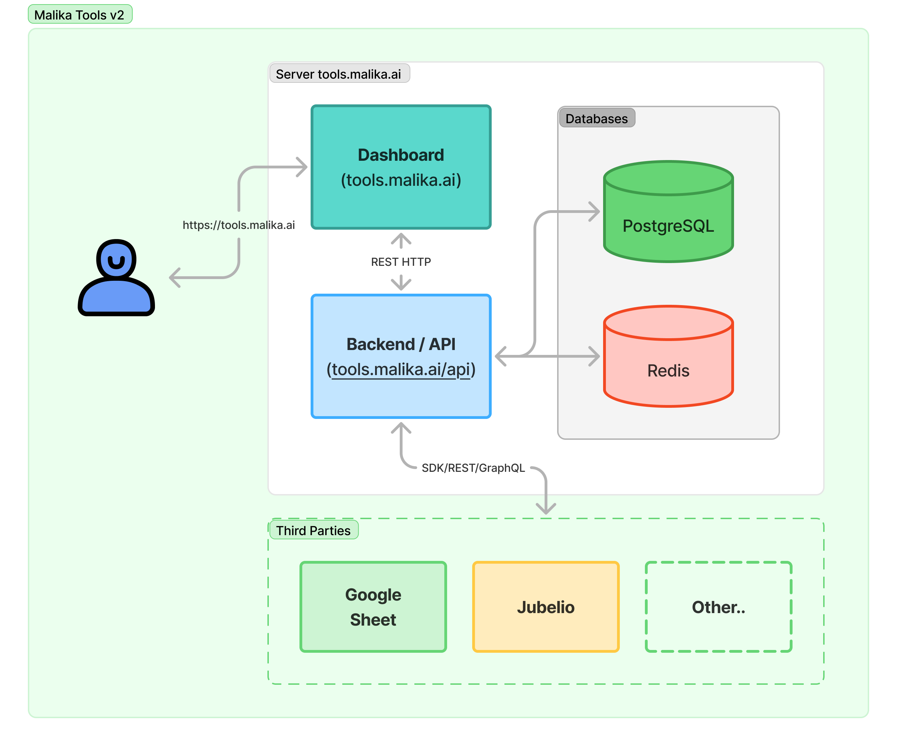

import { Card } from '@astrojs/starlight/components';

[Malika Tools](https://tools.malika.ai) adalah sebuah middleware yang menjembatani interaksi Cekat AI dengan sistem atau data milik klien. Malika Tools bertujuan buat jadi "pintu" yang standar buat Cekat AI untuk nyatuin berbagai data dan _use case_ yang beda-beda. Di sini, kamu bisa manfaatin fitur-fitur dari Malika Tools yang dijelasin sebagai berikut.

## Features

Buat sekarang ini, terdapat beberapa fitur utama yang udah dikembangin di Malika Tools ini, yaitu:

<Card title="Search" icon="seti:code-search">
  Digunain buat ngeintegrasiin Malika Tools dengan data dari pihak klien dengan platform yang macem-macem. Untuk saat ini, fitur Search hanya memiliki dua _connector_ terkait platform: Google Sheet dan Jubelio. Untuk penjelasan lengkap mengenai fitur Search dapat dilihat pada bagian [Search](/tools/search)
</Card>

<Card title="Cek Ongkir" icon="rocket">
  Pake API Raja Ongkir buat ngecek ongkir tapi input alamatnya jauh lebih simpel dan fleksibel. Terdapat 4 input: `origin`, `destination`, `courier`, dan `weight` yang wajib diisi untuk mendapatkan data harga ongkir. Untuk penjelasan lengkap mengenai fitur Cek Ongkir dapat dilihat pada bagian [Cek Ongkir](/tools/ongkir)
</Card>

<Card title="Custom Function" icon="seti:python">
  Di sini, kamu bisa nulis kode kamu sendiri yang bertujuan buat nglengkapin _edge cases_ yang tidak tercakup dari fitur-fitur di atas tapi tetep modular dan scalable, misal buat perhitungan total harga dengan kombinasi cek ongkir dan lain sebagainya. _Custom function_ ini pake _runtime_ Python sebagai kode utamanya. Untuk penjelasan lengkap mengenai fitur Custom Function dapat dilihat pada bagian [Custom Function](/tools/custom-function)
</Card>

<Card title="Invoice" icon="document">
  (Coming Soon). Untuk penjelasan lengkap mengenai fitur Invoice dapat dilihat pada bagian [Invoice](/tools/invoice)
</Card>

<Card title="...and Upcoming Features!" icon="information">
  Terdapat fitur fitur keren lain seperti _**scheduler**_, _**invoice**_, dan lain sebagainya yang masih dikembangin.
</Card>

## Inside the Tools

Malika Tools dibangun menggunakan FastAPI dengan basis Python versi 3.10+ untuk mengakomodir segala kebutuhan terkait proses bisnis di dalamnya. Untuk dashboard sendiri, Malika Tools menggunakan React yang di-bundle menggunakan Vite bundler untuk mempercepat proses build dari SPA yang dikembangkan daripada menggunakan Webpack. Yuk cek pembahasan mimin tentang detail tools-nya!

### Dashboard

Gak banyak yang bisa dijelasin di dashboard, intinya kamu bisa cek dashboard di https://tools.malika.ai ya! Untuk penjelasan dashboard pada setiap fitur, bisa dikunjungi di _sidebar_ sebelah kiri ya!

Halaman Login Malika Tools

Halaman Dashboard Malika Tools

### Backend

Pada Malika Tools, _backend_ dikembangkan secara terpisah dengan dashboard demi modularitas yang lebih baik. Backend dikembangkan menggunakan FastAPI yang ditulis dengan bahasa pemrograman Python. _Backend_ pada Malika Tools kali ini menggunakan PostgreSQL untuk alasan kecepatan dan kemampuan _extension_ yang sangat banyak. _Address_ yang digunakan untuk mengakses backend ini adalah https://tools.malika.ai/api. 

Gambar di bawah adalah arsitektur dari Malika Tools secara keseluruhan.

Arsitektur Malika Tools v2

## What is the Differences with Old Malika Tools?

Malika Tools kali ini di-_rebrand_ pake nama **Malika Tools v2**, yang ngemantepin Malika Tools sebelumnya yang udah dikembangin dan di-_hosting_ di domain https://tools-malikaai.479067.my.id. Cek buat ngerti perbedaannya lebih banyak, baik dari sisi teknis ataupun cara kerja.

| Perbedaan | Old Malika Tools | Malika Tools v2 |
|---|---|---|
| Arsitektur | Flask + MongoDB | FastAPI + PostgreSQL + Redis  |
| Alamat | [tools-malikaai.479067.my.id](https://tools-malikaai.479067.my.id) | [tools.malika.ai](https://tools.malika.ai) |
| Fitur | <ul><li>Search: Google Sheet</li><li>Custom Function</li></ul> | <ul><li>Search: Google Sheet, Jubelio</li><li>Custom Function</li><li>Cek Ongkir</li><li>Invoice (On Development)</li></ul> |
| Butuh Sinkronisasi Data | **Tidak**, karena tools langsung membaca Google Sheet | **Iya**, karena tools _cloning_ data Google Sheet ke database internal Malika |
