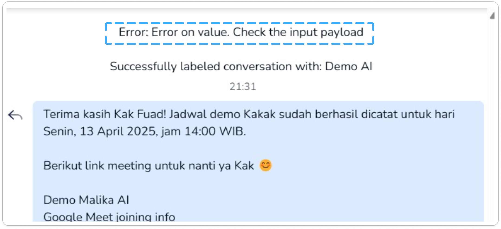

Di sini, kamu bisa menjumpai berbagai FAQ atau _Frequently Asked Questions_ seputar error yang terjadi, baik dari sisi Cekat AI ataupun dari Malika Tools

Kak AI-nya kok gak jawabnya gak bener padahal datanya ada?

AI jawab gak bener faktornya banyak banget: bisa dari tools ga kepanggil, bisa dari tools emang salah ngasih jawaban, bisa dari error dari servernya, atau emang AI-nya yang ga paham. 

Biar mempermudah, kamu bisa buka https://ai.aksoro.co.id (apabila belum integrasi) atau CRM dari masing-masing klien (apabila udah integrasi) dulu. Kalo udah dibuka, coba navigasi ke halaman Chat dan cari chat yang relevan sama tools yang error tersebut. Lalu _screnshoot_ blok kode sebelum si AI ngasih pesan yang ga bener karena _tools_ error.

Contoh SS-nya seperti ini:

Contoh Pesan Error

Biasanya ada beberapa hal yang bisa jadi indikator:
1. Kalo ga ada tulisan sama sekali, berarti AI gak manggil tools _then_ AI ngawur ngasih jawaban -> AI salah
2. Kalo ada tulisan "Success blablabla" tapi hasilnya salah, berarti ada kesalahan algoritma/perhitungan dari sisi tools -> Tools salah
3. Kalo ada tulisan "Error: blablabla", berarti ada error di tools -> Tools salah

Kalau udah dapet, bisa di-_report_ _by chat_ Backend Engineer Malika ya! 

Kak, kok gak bisa manggil _tools_ ya?

_Tools_ yang ga kepanggil dari AI kemungkinan sangat besar adalah ketidaktahuan dari si AI, entah karena prompting yang terlalu _obfuscate_ (campur aduk) atau inkonsistensi (dipangil di _behavior_, juga di _knowledge_, juga di _description_ tools). Coba diubah2 lagi _prompting_-nya atau diletakkan di bagian _mandatory_ mungkin bisa membantu.

