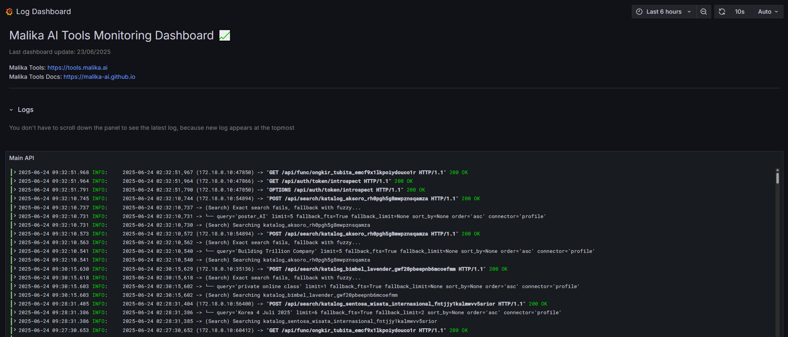

## Apa itu _Server Observability_?

_Server observability_ adalah teknik untuk mengamati dan memahami performa dan kondisi dari server yang sedang berjalan. Biasanya, _observability_ ini dilakukan untuk mengetahui apakah server sedang berjalan dengan baik atau tidak, dan apakah ada masalah yang terjadi pada server tersebut. Banyak tools yang bisa digunakan untuk melakukan _observability_ ini, salah satunya adalah [Prometheus](https://prometheus.io/). 

## Cara membuka dashboard observability

Kamu bisa buka _dashboard observability_ dengan mengakses [Public Dashboard](https://tools.malika.ai/grafana/public-dashboards/fdf353e018f9498598de5ab95477644e). Di situ, kamu bisa melihat log dari server yang sedang berjalan. Dengan begitu, kamu bisa ngecek hasil dari _request_ _custom function_ atau _search_ yang sedang berjalan, apakah ada yang error atau tidak.

Contoh Tampilan Dashboard

