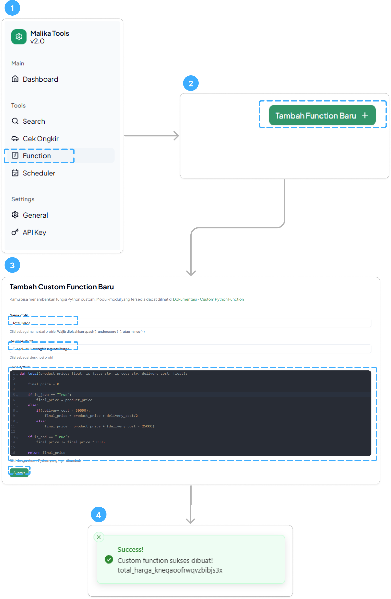
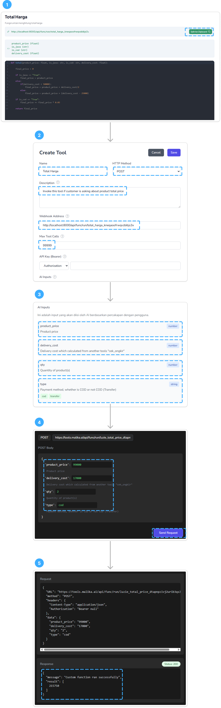

import { Aside, Card } from '@astrojs/starlight/components';

Selain fitur [Search](/tools/search) dan [Ongkir](/tools/ongkir), Malika Tools juga nyediain fitur Custom Function, di mana kamu bisa nulis kode Python kamu sendiri untuk ngeakomodir _use case_ yang gak bisa diselesein dari fitur2 yang dah ada, tapi secara lebih fleksibel dan skalabel.


## Prepare the Code

Sebelum _dive deep_ ngecoba fitur ini, jangan lupa siapin kode kamu ya. Pastikan gak ada error di kode kamu sebelum dibuat _webhook_ khusus untuk itu. Kamu bisa IDE apapun yang kamu mau--Jupyter Notebook, Google Colab, atau bahkan VS Code juga boleh yang penting kodenya **Python**.

Setelah fungsi kamu siap, kamu hanya perlu fungsi tunggal `def` tanpa _import_ apa-apa, karena _import_ sudah diatur di bagian [Available Modules](#available-modules).

<Aside>

Versi Python yang digunakan di Malika Tools adalah versi `3.11.x`

</Aside>

### Available Modules

Terdapat beberapa modul yang bisa digunakan di dalam kode kamu. Ada beberapa modul yang _built-in_ dari Python, dan ada modul yang hanya tersedia di Malika Tools ini.

#### Python Built-in Modules

Tidak semua _module_ disediakan untuk _runtime_ Custom Function ini ya, tapi kamu bisa akses beberapa _additional module_ dari _third party_ seperti: 

| No. | Module | Dokumentasi |
|-----|--------|-------------|
| 1   | `numpy` | [Dokumentasi `numpy`](https://numpy.org/doc/) |
| 2   | `math` | [Dokumentasi `math`](https://docs.python.org/3/library/math.html) |
| 3   | `base64` | [Dokumentasi `base64`](https://docs.python.org/3/library/base64.html) |
| 4   | `pytz` | [Dokumentasi `pytz`](https://pypi.org/project/pytz/) |
| 5   | `collections` | [Dokumentasi `collections`](https://docs.python.org/3/library/collections.html) |
| 6   | `evaluate` | [Dokumentasi `eval`](https://docs.python.org/3/library/functions.html#eval) |
| 7   | `request` | [Dokumentasi `requests.request`](https://requests.readthedocs.io/en/latest/api/#requests.request) |
| 8   | `re` | [Dokumentasi `re`](https://docs.python.org/3/library/re.html) |
| 9   | `datetime` | [Dokumentasi `datetime`](https://docs.python.org/3/library/datetime.html#datetime-objects) |
| 10  | `dt` | [Dokumentasi `datetime.datetime`](https://docs.python.org/3/library/datetime.html#datetime.datetime) |
| 11  | `timedelta` | [Dokumentasi `datetime.timedelta`](https://docs.python.org/3/library/datetime.html#datetime.timedelta) |
| 12  | `http` | [Dokumentasi `http`](https://www.python-httpx.org/api/) |

#### Malika Tools Modules

Selain itu, ada juga _module_-_module_ internal milik Malika Tools yang bisa kamu pake. Kamu bisa melakukan pemanggilan modul-modul menggunakan fungsi `call(<nama-modul>, <payload>)` tersebut dengan cara seperti ini:

```python
# Contoh fungsi untuk search profile Google Sheet 
async def contoh():
  payload = {
    "profile_id": "qhomemart_12345",
    "body": {
      "query": "selang",
      "limit": 10
    }
  }

  # Berupa object dengan key 'message' dan 'result'
  response = await call("search", payload) 
  return response['result']
```

<Aside>

Semua fungsi Malika Tools merupakan fungsi `async` ya, jadi kamu harus menambahkan `await` di depan fungsi yang dipanggil. 

</Aside>

Lalu, apa saja nama-nama modul beserta payload yang tersedia? Dapat dilihat pada tabel berikut:

<table>
  <tr>
    <th><div style="width:12rem;">Nama Modul</div></th>
    <th>Cara Menggunakan Modul</th>
    <th>Isi variabel `response`</th>
  </tr>
  <tr>
    <td>
    `search`
    </td>
    <td>
    Melakukan pemanggilan `search` untuk mencari data di Database: Google Sheet, Jubelio, atau REST API. Perlu membuat profile baru dulu lalu dapetin ID-nya.

    ```python
    payload = {
      "profile_id": "indo_super_group",
      "body": {
        "query": "selang",
        "limit": 10,
        "fallback_fts": False, # Optional, default: True
        "fallback_limit": 5, # Optional, default: 10
        "sort_by": "col-1", # Optional, default: first column
        "sort_order": "asc", # Optional, default: "asc"
        "connector": "gsheet" # Optional, default: "gsheet"
      }
    }

    response = await call("search", payload)
    ```
    </td>
    <td>
    ```json
    {
      "message": "<message>",
      "result": [
        {"col-1": "value", "col-2": "value2"},
        {"col-1": "value3", "col-2": "value4"}
        ...
      ]
    }
    ```
    </td>
  </tr>
  <tr>
    <td>`direct_search`</td>
    <td>
    Melakukan pemanggilan `direct_search` untuk mencari data di Google Sheet. Perlu membuat Google Sheet profile terlebih dahulu lalu dapetin ID-nya.

    ```python
    payload = {
      "profile_id": "indo_super_group",
      "body": {
        "query": "selang",
        "limit": 10,
        "fallback_fts": False, # Optional
        "fallback_limit": 10 # Optional
      }
    }

    response = await call("direct_search", payload)
    ```
    </td>
    <td>
    ```json
    {
      "message": "<message>",
      "result": [
        {"col-1": "value", "col-2": "value2"},
        {"col-1": "value3", "col-2": "value4"}
        ...
      ]
    }
    ```
    </td>
  </tr>
  <tr>
    <td>`cek_ongkir`</td>
    <td>
    Melakukan cek ongkir dengan API RajaOngkir

    ```python
    payload = {
      "body": {
        "origin": "Aksoro",
        "destination": "Swalayan Negasa",
        "courier": "jne",
        "weight": 1300
      }
    }

    response = await call("cek_ongkir", payload)
    ```
    </td>
    <td>
    ```json
    {
      "message": "<message>",
      "result": {
        "origin": {
          "province": "<province-1>",
          "city": "<city-1>",
          "subdistrict": "<subdistrict-1>"
        },
        "destination": {
          "province": "<province-2>",
          "city": "<city-2>",
          "subdistrict": "<subdistrict-2>"
        },
        "ongkir": {
          "code": "jne",
          ...
        },
      }
    }
    ```
    </td>
  </tr>
  <tr>
    <td>`search_address`</td>
    <td>
    Melakukan pemanggilan `search_address` untuk mencari data alamat pakai query.

    ```python
    payload = {
      "headers": {
        "X-API-Key": "<api-key>" # api-key can be obtained from dev
      },
      "body": {
        "query": "Aksoro"
      }
    }

    response = await call("search_address", payload)
    ```
    </td>
    <td>
    ```json
    {
      "message": "<message>",
      "result": {
        "id": "<id>",
        "name": "<name>",
        "address_name": "<address_name>",
        "subdistrict": "<subdistrict>",
        "district": "<district>",
        "province": "<province>",
        "country": "<country>",
        "latitude": 0,
        "longitude": 0,
        "location_id": "<location-id>"
      }
    }
    ```
    </td>
  </tr>
  <tr>
    <td>`nearest_location`</td>
    <td>
    Mencari lokasi terdekat menggunakan fitur _nearest location_. Perlu membuat profil Nearest Location terlebih dahulu lalu dapetin ID-nya.

    ```python
    payload = {
      "nearest_location_id": "ebliethos_12345",
      "body": {
        "query": "Aksoro" # Address to search
      }
    }

    response = await call("nearest_location", payload)
    ```
    </td>
    <td>
    ```json
    {
      "message": "<message>",
      "result": [
        {
            "id": "<id-1>",
            "name": "Cabang Cilacap",
            "address_name": "Sampang, Cilacap Regency, Central Java, Indonesia",
            ...
            "distance": 125.75644669718577
        },
        {
            "id": "<id-2>",
            "name": "Cabang Surabaya",
            "address_name": "Rungkut, Surabaya, East Java, Indonesia",
            ...
            "distance": 275.79143867984294
        }
      ]
    }
    ```
    </td>
  </tr>
  <tr>
    <td>`gsheet_add_rows`</td>
    <td>
    Menambahkan banyak data ke Google Sheet. Perlu membuat Google Sheet profile terlebih dahulu lalu dapetin ID-nya.

    ```python
    payload = {
      "headers": {
        "X-API-Key": "<api-key>" # api-key can be obtained from dev
      },
      "profile_id": "indo_super_group",
      "exclude_id": True, # If true, the first column will be excluded from the data. Default: True
      "body": [
          {"col-1": "new-value-1", "col-2": "new-value-2"}, 
          {"col-1": "new-value-3", "col-2": "new-value-4"} 
          ...
      ]
    }

    response = await call("gsheet_add_rows", payload)
    ```
    </td>
    <td>
    ```json
    {
      "message": "<message>",
      "result": {
        "id": "<profile-id>"
      }
    }
    ```
    </td>
  </tr>
  <tr>
    <td>`gsheet_add_row`</td>
    <td>
    Menambahkan satu baris data ke Google Sheet. Perlu membuat Google Sheet profile terlebih dahulu lalu dapetin ID-nya.

    ```python
    payload = {
      "headers": {
        "X-API-Key": "<api-key>" # api-key can be obtained from dev
      },
      "profile_id": "indo_super_group",
      "exclude_id": True, # If true, the first column will be excluded from the data. Default: True
      "body": {"col-1": "new-value-1", "col-2": "new-value-2", "col-...": "new-value-..."}
    }

    response = await call("gsheet_add_row", payload)
    ```
    </td>
    <td>
    ```json
    {
      "message": "<message>",
      "result": {
        "id": "<profile-id>"
      }
    }
    ```
    </td>
  </tr>
  <tr>
    <td>`gsheet_upsert_row`</td>
    <td>
    Menambahkan atau memperbarui satu baris data di Google Sheet berdasarkan ID. Perlu membuat Google Sheet profile terlebih dahulu lalu dapetin ID-nya.

    ```python
    payload = {
      "headers": {
        "X-API-Key": "<api-key>" # api-key can be obtained from dev
      },
      "profile_id": "indo_super_group",
      "body": {"id": "row-id", "col-1": "updated-value-1", "col-2": "updated-value-2"}
    }

    response = await call("gsheet_upsert_row", payload)
    ```
    </td>
    <td>
    ```json
    {
      "message": "<message>",
      "result": {
        "id": "<profile-id>"
      }
    }
    ```
    </td>
  </tr>
  <tr>
    <td>`gsheet_upsert_rows`</td>
    <td>
    Menambahkan atau memperbarui banyak baris data di Google Sheet berdasarkan ID. Perlu membuat Google Sheet profile terlebih dahulu lalu dapetin ID-nya.

    ```python
    payload = {
      "headers": {
        "X-API-Key": "<api-key>" # api-key can be obtained from dev
      },
      "profile_id": "indo_super_group",
      "body": [
        {"id": "row-id-1", "col-1": "updated-value-1", "col-2": "updated-value-2"},
        {"id": "row-id-2", "col-1": "updated-value-3", "col-2": "updated-value-4"}
      ]
    }

    response = await call("gsheet_upsert_rows", payload)
    ```
    </td>
    <td>
    ```json
    {
      "message": "<message>",
      "result": {
        "id": "<profile-id>"
      }
    }
    ```
    </td>
  </tr>
  <tr>
    <td>`gsheet_sync`</td>
    <td>
    Melakukan sinkronisasi data Google Sheet dengan database lokal. Perlu membuat Google Sheet profile terlebih dahulu lalu dapetin ID-nya.

    ```python
    payload = {
      "headers": {
        "X-API-Key": "<api-key>" # api-key can be obtained from dev
      },
      "profile_id": "indo_super_group"
    }

    response = await call("gsheet_sync", payload)
    ```
    </td>
    <td>
    ```json
    {
      "message": "<message>",
      "result": {
        "id": "<profile-id>"
      }
    }
    ```
    </td>
  </tr>
  <tr>
    <td>`gsheet_get`</td>
    <td>
    Mengambil data dari Google Sheet berdasarkan profile ID. Perlu membuat Google Sheet profile terlebih dahulu lalu dapetin ID-nya.

    ```python
    payload = {
      "headers": {
        "X-API-Key": "<api-key>" # api-key can be obtained from dev
      },
      "profile_id": "indo_super_group"
    }

    response = await call("gsheet_get", payload)
    ```
    </td>
    <td>
    ```json
    {
      "message": "<message>",
      "result": [
        {"col-1": "value", "col-2": "value2"},
        {"col-1": "value3", "col-2": "value4"}
        ...
      ]
    }
    ```
    </td>
  </tr>
  <tr>
    <td>`schedule_job_once`</td>
    <td>
    Menjadwalkan webhook job yang akan dijalankan sekali pada waktu tertentu. Job akan mengirim POST request ke URL yang ditentukan dengan data dan headers yang diberikan.

    ```python
    payload = {
      "headers": {
        "X-API-Key": "<api-key>" # api-key can be obtained from dev
      },
      "body": {
        "profile_name": "send_notification",
        "url": "<your-webhook-url>", # If you want internal webhook, you can use the format: f'{HOST}/<path>'
        "data": {
          "key-1": "value-1",
          "key-2": "value-2",
          ...
        },
        "headers": {
          "Content-Type": "application/json",
          ...
        },
        "hour": 10,   
        "minute": 0,  
        "second": 0   
      }
    }

    response = await call("schedule_job_once", payload)
    ```
    </td>
    <td>
    ```json
    {
      "message": "Task scheduled successfully",
      "result": {
        "job": "2024-01-15T10:00:00+07:00"
      }
    }
    ```
    </td>
  </tr>
  <tr>
    <td>`run_func`</td>
    <td>
    Menjalankan fungsi custom function lain berdasarkan function ID. Berguna untuk membuat fungsi yang saling terhubung.

    ```python
    payload = {
      "headers": {
        "X-API-Key": "<api-key>" # api-key can be obtained from dev
      },
      "func_id": "calculate_total_12345",
      "body": {
        "arg-1": "value-1",
        "arg-2": "value-2",
        ...
      }
    }

    response = await call("run_func", payload)
    ```
    </td>
    <td>
    ```json
    {
      "message": "<message>",
      "result": "<result-from-custom-function>"
    }
    ```
    </td>
  </tr>
</table>


### Example

Misal kamu ingin membuat fungsi untuk menghitung total harga produk yang rumit dan tidak bisa diselesein sama AI. Pastiin kamu udah nulis dan udah coba dites di lokal. Untuk contoh kodenya kurang lebih seperti ini:

```python
def total(product_price: float, is_java: str, is_cod: str, delivery_cost: float):

  final_price = 0

  if is_java == "True":
    final_price = product_price
  else:
    if(delivery_cost < 50000):
        final_price = product_price + delivery_cost/2
    else:
        final_price = product_price + (delivery_cost - 25000)
  
  if is_cod == "True":
    final_price += final_price * 0.03

  return final_price 
```

<Aside type="danger">

Kamu tidak perlu menggunakan return di `def`, karena dapat menyebabkan error. Misal seperti ini:

```python

# Salah ❌
def total(final_price: float) -> float:
  return final_price

# Benar ✅
def total(final_price: float):
  return final_price
```

</Aside>

### More Complex Example

Misal kamu ingin membuat fungsi untuk menghitung ongkir dari kantor Aksoro, yang mana data asalnya didapat dari modul _nearest location_ dari gudang Ebliethos, kamu dapat melakukan hal seperti ini:

```python
async def nearest_ongkir():  
  # Define the destination first
  destination = "Aksoro"
  
  # Call the nearest_location module
  payload_nearest = {
    "nearest_location_id": "ebliethos_o77xhq8bsa2teolpf6ek",
    "body": {
      "query": destination
    }
  }
  response = await call("nearest_location", payload_nearest)

  # Get nearest address then pick the address name
  nearest = response['result'][0]["address_name"]

  # Then call the cek_ongkir module
  payload_ongkir = {
    "body": {
      "origin": nearest, # Use nearest address
      "destination": destination,
      "courier": "jne", # or 'sicepat' or 'ninja' or anything else
      "weight": 1000 # in KG
    }
  }
  response = await call("cek_ongkir", payload_ongkir)

  return response['result']
```

Fungsi tersebut akan mengembalikan hasil seperti ini:

```json
{
  "origin": {
    "province": "Jawa Tengah",
    "city": "Kabupaten Cilacap",
    "subdistrict": "Sampang"
  },
  "destination": {
    "province": "DI Yogyakarta",
    "city": "Kabupaten Sleman",
    "subdistrict": "Gamping"
  },
  "ongkir": {
    "code": "jne",
    "name": "Jalur Nugraha Ekakurir (JNE)",
    "costs": [
      {
        "service": "JTR",
        "description": "JNE Trucking",
        "cost": [
          {
            "value": 40000,
            "etd": "4-5",
            "note": ""
          }
        ]
      },
      {
        "service": "REG",
        "description": "Layanan Reguler",
        "cost": [
          {
            "value": 12000,
            "etd": "3-6",
            "note": ""
          }
        ]
      },
      {
        "service": "YES",
        "description": "Yakin Esok Sampai",
        "cost": [
          {
            "value": 15000,
            "etd": "1-1",
            "note": ""
          }
        ]
      }
    ]
  }
}
```

Mudah bukan? 😁👍

## Create New Function

Setelah kodenya sudah siap dan tanpa _error_, kamu bisa membuat profil/_webhook_ baru di Malika Tools sebagai berikut:


<p style="text-align:center;">Membuat Profil/_Webhook_ Baru untuk Custom Function</p>


## Register the Custom Function Webhook to Cekat AI

Kalau buat kodenya dah berhasil, kamu bisa daftarin profil/_webhook_ baru itu ke Cekat AI lewat fitur Integrations-nya.


<p style="text-align:center;">Alur Mendaftarkan _Webhook_ ke Cekat AI</p>

Sebelum di-_prompting_ untuk menyesuaikan terhadap fungsi baru yang udah dibuat, tes dulu apakah fungsinya bekerja dengan baik apa belum seperti yang ada di gambar pada langkah 4 dan 5.

## Update and Delete

Terdapat juga opearasi _update_ dan _delete_ fungsi yang sudah dibuat di bagian bawah kanan tampilan.


<p style="text-align:center;">_Update_ dan _Delete_ Custom Function</p>

## Run (New)

Sekarang, kamu bisa langsung menjalankan fungsi di dalam dashboard tools.malika.ai loh! Caranya dengan klik tombol Run di bagian tombol bawah kanan.


<p style="text-align:center;">Menjalankan Custom Function</p>