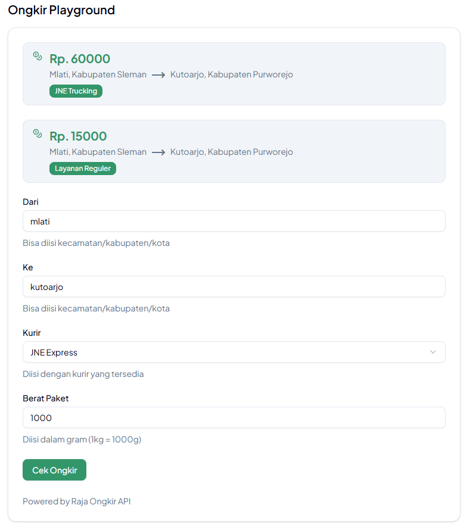

Meskipun dari Cekat AI sudah punya _built-in_ tools untuk cek ongkir, kamu juga bisa pake _webhook_ dari Malika Tools juga lho. FYI, fitur Cek Ongkir di Malika Tools pake Raja Ongkir API sebagai basis datanya. Jadi, kalau klien minta pakai platform Raja Ongkir untuk cek ongkir, bisa pake ini ya! 

## Register the Ongkir Webhook to Cekat AI

Di sini, sebenernya kamu gak perlu buat tools baru lagi di Cekat AI karena udah dibuat dari dulu, yaitu bernama `cek_ongkir`

Tools `cek_ongkir` di Cekat AI

Yang kamu perluin hanyalah _copy tools_ tersebut ke akun Cekat AI milik klien ketika proses integrasi udah dijalanin. Tapi biar afdol, tetep mimin jelasin ya tentang apa aja sih input yang bisa dikasih ke `cek_ongkir` ini. Cekidot!

Input `cek_ongkir` yang Dibutuhkan

#### 1. `origin` (Wajib)

Diisi dengan nama kecamatan atau nama kabupaten pengirim. Apabila diisi nama kabupaten, maka kecamatan akan dipilih dengan urutan abjad paling awal.

#### 2. `destination` (Wajib)

Diisi dengan nama kecamatan atau nama kabupaten destinasi. Apabila diisi nama kabupaten, maka kecamatan akan dipilih dengan urutan abjad paling awal.

#### 3. `courier` (Wajib)

Diisi dengan kode kurir. Berikut adalah kode kurir yang tersedia.

- `sicepat`: SiCepat Express
- `pos`: POS Indonesia
- `tiki`: Citra Van Titipan Kilat (TIKI)
- `jne`: Jalur Nugraha Ekakurir (JNE)
- `pcp`: PCP Express
- `esl`: Eka Sari Lorena (ESL)
- `rpx`: RPX Holding
- `pandu`: Pandu Logistics
- `wahana`: Wahana Prestasi Logistik
- `jnt`: J&T Express
- `pahala`: Pahala Kencana Express
- `cahaya`: Cahaya Logistik
- `sap`: SAP Express
- `jet`: JET Express
- `indah`: Indah Logistik Cargo
- `dse`: DSE Express
- `slis`: SLIS Express
- `first`: First Logistics
- `ncs`: NCS Logistics
- `ninja`: Ninja Xpress
- `star`: Star Cargo

#### 4. `weight` (Opsional, _default_-nya `1000`)

Diisi dengan berat paket dalam gram, misal `1200` untuk paket dengan berat total 1,2 kg.

## Ongkir Playground

Kamu juga bisa nyoba Ongkir Playground buat "mainan" dan coba-coba fitur ini di https://tools.malika.ai pada bagian _sidebar_ Ongkir. Kamu bisa input data sesuai yang tertera untuk ngerti berapa sih sebenernya harga ongkir dari kecamatan A ke kecamatan B.

Ongkir Playground
