import { Aside } from '@astrojs/starlight/components';

Salah satu fitur utama yang diandelin banget di Malika Tools ini ya jelas fitur **Search**. Di sini, kamu bisa ngeintegrasiin data klien di luar sana yang punya platform beda-beda lewat tools ini. Adanya tools ini tentunya ngemudahin banget buat AI, karena tools ini bisa jadi orkestrator buat nyatuin data klien ke satu "rumah" biar AI bisa nyari data katalog dengan _keyword_ yang lebih fleksibel dan _human-like_ tanpa mengorbankan akurasi dan performa pencarian. Adanya tools ini juga bantu ngemudahin kita biar semua proses pencarian data klien yang format dan platform-nya macem-macem itu cuma lewat satu pintu aja. Gimana, keren kan!

<Aside type="note">

#### Funfact about Search Operation

Algoritma pencarian di ranah teknologi macem algoritma yang dipake di mesin pencarian lain biasanya punya _tradeoff_ penting: **akurasi/performa vs fleksibilitas**. Semakin sebuah pencarian bisa ngeakomodir teknologi-teknologi keren buat ningkatin nilai fleksibilitas seperti _typo handling_, pencarian berbasis suku kata, _fuzzy search_, dan lainnya, maka akurasi akan kurang "_exact_" dan _cost_ untuk performa juga lebih tinggi. Hal tersebut berlaku juga untuk sebaliknya.

Di fitur Search milik Malika Tools ini, kamu bisa memilih apakah algoritma pencarian akan dilakukan secara akurat (_exact_) atau lebih fleksibel (_fuzzy_). Apabila hasil pencarian yang harus eksak seperti data tentang elektronik yang memiliki tipe spesifik, maka ada baiknya menggunakan pencarian _exact_. Apabila hasil pencarian lebih fleksibel seperti makanan atau furnitur, maka lebih baik gunakan pencarian _fuzzy_.

</Aside>

Untuk saat ini, Malika Tools baru punya 2 connector untuk nyambungin ke platform tertentu, yaitu: **Google Sheet** dan **Jubelio**. Nantinya, _connector_-_connector_ akan ditambah nyesuain keinginan dan kebutuhan data dari klien-klien yang makin variatif dan banyak.

## How this Feature Works Under the Hood

Seperti yang udah dijelasin di bagian [Understanding Malika Tools](/general/malika-tools#what-is-the-differences-with-old-malika-tools) tentang apa bedanya Malika Tools yang baru (v2) dan yang lama, adalah pada perbedaan mengolah data dari _third party_. Pada versi sebelumnya, pencarian data yang dilakukan oleh tools langsung coba nyari _item_ di data klien yang terletak di Google Sheet, sedangkan pada tools baru, data klien yang ada di Google Sheet dikloning dahulu ke database internal Malika, lalu **pencarian beroperasi di database internal tersebut, alih-alih langsung di Google Sheet**. Hal tersebut membuat tools baru secara berkala harus disinkronisasi menggunakan trigger yang disediakan di https://tools.malika.ai setiap terdapat perubahan data klien yang terletak di Google Sheet. Biar lebih jelas, kuy bisa cek diagram perbandingan berikut.

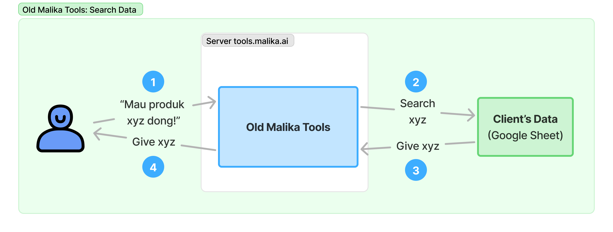

Alur Pencarian Tools Lama

Pada alur tools yang lama, operasi pencarian cenderung _straightforward_, alias item yang diinginkan sama _customer_ langsung dicari di sumbernya--Google Sheet langsung tanpa ada intermediate process di dalemnya. Dengan gitu, tools yang lama tidak perlu buat nglakuin sinkronisasi data karena emang pencariannya diselesaikan secara langsung ke data mentah klien.

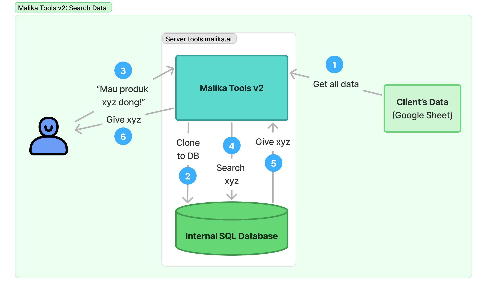

Alur Pencarian Tools Baru

Beda dengan alur tools yang baru (Malika Tools v2), di mana pencarian data tidak langsung ke data mentah klien yang ada di Google Sheet (atau sumber lain), tapi dikloning dulu ke database internal Malika lalu pencarian dijalanin di dalem database internal itu. 

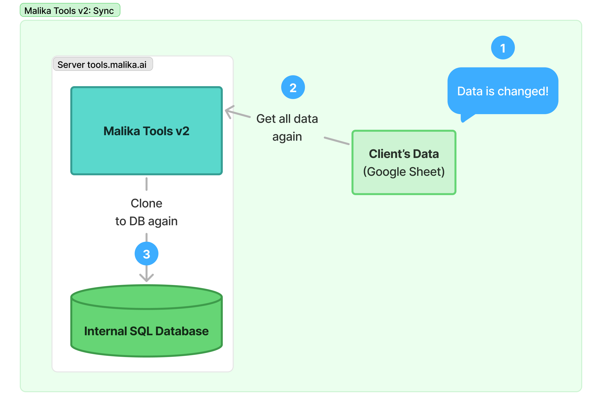

Proses Sinkronisasi Data Tools Baru

Karena ada duplikasi data hasil kloning, yaitu di data mentah klien (Google Sheet) dan data kloningan (database internal), maka perlu banget untuk sinkronisasi data setiap kali ada perubahan di data mentah klien yang ada di Google Sheet agar item yang dicari tools tetap relevan.

### Just.. Why?

Mungkin kalian mikir gini... 
> Ngapain repot2 harus _clone_ ke database dulu? bukannya malah jadi repot?

Yak betul, mimin _personally_ setuju. Di salah satu aspek, alur di tools baru akan menyebabkan redundansi data karena perlu dilakuin kloning data setiap kali data asal klien berubah. Ini bakal lumayan PR kalo data yang dikloning terlalu gede sampai-sampai bikin server lambat. 

Tapi, implementasi kayak gini nyelesein beberapa _stuck_ yang gak bisa diselesein di tools sebelumnya, yakni:

1. Pencarian dilakuin di database internal Malika alih-alih langsung di Google Sheet, yang mana pake PostgreSQL buat basis datanya. PostgreSQL memungkinkan operasi CRUD (_Create Read Update Delete_) yang **JAUH lebih kencang** daripada pencarian langsung ke Google Sheet menggunakan API.
2. PostgreSQL saat ini nyediain ekstensi terkait algoritma pencarian yang sangat beragam tanpa ngorbanin performa yang jadiin dia **super fleksibel**. Dia bisa nglakuin _exact search_ (istilah kerennya Full-Text Search atau FTS) bersamaan dengan _fuzzy_. Selain itu, penggunakan PostgreSQL juga sekalian digunain buat database utama untuk menyimpan konfigurasi atau data internal terkait aplikasi Malika Tools.
3. Karena lebih kenceng, penggunaan database ini otomatis jadi **ningkatan RPS** (_request per second_) yang punya tujuan utama untuk **ningkatin keandalan** Malika Tools kalau-kalau kliennya makin banyak dan akses tools-nya bebarengan.

<Aside type="note">

#### Funfact about PostgreSQL Usage

Lazim di pengembangan aplikasi-aplikasi yang gede macem Tokopedia menggunakan _multi database_ dengan berbagai skema dan teknologi untuk menyesuaikan _use case_ bisnis. Database yang digunakan untuk melakukan transaksi (OLTP-based) biasanya dipisah dengan database yang digunakan untuk analisis (OLAP-based) karena transaksi memerlukan komputasi _write_ yang jauh lebih besar daripada analisis. Biasanya, aplikasi-aplikasi tersebut menggunakan PostgreSQL atau SQL-based lain untuk OLTP, dan Elasticsearch untuk OLAP. 

Hal tersebut secara gak langsung (meskipun gak terlalu mirip) juga diadopsi di Malika Tools ini, di mana data klien bertindak sebagai "data transaksi" dan PostgreSQL bertindak sebagai "data analisis" untuk keperluan _search_ data dan lain sebagainya. 

</Aside>

Oke, karena udah tau gimana cara kerja si Malika Tools spesifik buat fitur ini, maka bisa disimpulin kalo sinkronisasi data setiap setelah data asli dari klien diubah itu **WAJIB HUKUMNYA**. Biar ngemudahin kalian para trainer buat ngesinkronin data klien yang ganti-ganti mulu, kalian bisa ngasih url Trigger Sinkronisasi (dibahas setelah ini) yang bisa dikasihin ke klien. Dengan gitu, klien bisa ngesinkronin secara mandiri tiap kali mereka ngubah data mereka masing-masing.

## Google Sheet

Platform pertama yang bisa disambungin sama si Malika Tools yaitu jelas Google Sheet, berikut adalah panduan-panduan biar kamu ngerti gimana sih cara pake fitur ini. Cekidot!

### Data Preparation

Di bagian ini, kamu harus nyiapin format data Google Sheet yang bener biar bisa dibaca si Malika Tools

#### 1. Clean table format

Format tabel harus simpel. **1 _worksheet_ untuk 1 tabel dengan 1 baris header dan n baris untuk data**, _that's it_. _Merge cells_, banyak tabel kecil dalam satu _worksheet_, baris pembatas, dll tidak bisa ditolerir. 

Apabila memungkinkan, gabung beberapa tabel yang relevan menjadi 1 tabel besar di dalam 1 worksheet. Apabila tidak, maka dipisahkan dengan _worksheet_ yang berbeda.

Penamaan _header_ tabel juga diusahakan normal atau hindari karakter-karakter aneh seperti @, $, %, dll. Spasi diperbolehkan.

#### 1.1 Table must starts from top left (or A1 cell)

Tabel tidak boleh mulai dari tengah-tengah, ataupun bergeser dari pojok kiri atas _even_ satu _cell_-pun

#### 2. Unique ID is mandatory

Buat 1 kolom baru di sebelah paling kiri untuk dijadikan ID dari setiap baris pada data. Penamaan header bebas, boleh ID, boleh PK, boleh yang lain. **ID yang dipakai harus angka!**

<Aside type="tip">

##### Tip for Creating ID

Umumnya, ID yang unik tapi simpel terdiri dari angka. Kamu bisa membuatnya pakai rumus `=SEQUENCE(COUNTA(B2:B))` untuk membuat ID dari angka urut.

</Aside>

#### 3. No dangling spreadsheet item which located at somewhere

Pastiin tidak ada _value_ yang keluar dari _cell_ yang dah didefinisiin di tabel. Pastiin juga setiap sheet bersih hanya data dari tabel saja

#### 4. Image must be converted to link 

Gambar harus berupa link dengan akhiran format .jpg, .jpeg, .png, dll (contoh: https://www.todayifoundout.com/wp-content/uploads/2017/11/rick-astley.png). Sebaiknya jangan gunakan link gambar yang disimpan di Google Drive, karena tidak terdapat akhiran format gambar seperti .png, yang menyebabkan gambar tidak bisa tertampil di _live chat_ atau _connected platform_ yang lain.

<Aside type="tip">

#### Tip for Converting Images

Malika punya tools lain untuk mengunggah gambar lalu diubah ke dalam bentuk link, yang dapat diakses di https://app.malika.ai.

</Aside>

#### 5. Publicly accessed or private + service account

Agar Malika Tools bisa baca data-data yang disimpan di Google Sheet, kamu harus memilih 1 dari 2 langkah yang bisa diambil:
1. Buat Google Sheet klien bisa diakses publik dan buat semua orang yang mengakses memiliki _role_ Editor
2. Google Sheet tetap dibuat privat, tapi jangan lupa untuk menambahkan Google Service Account (GSA) dari Malika. Alamat email _service account_ dapat dilihat pada https://tools.malika.ai pada _sidebar_ menu Settings > General (biasanya berformat `xx@xx.iam.gserviceaccount.com`)

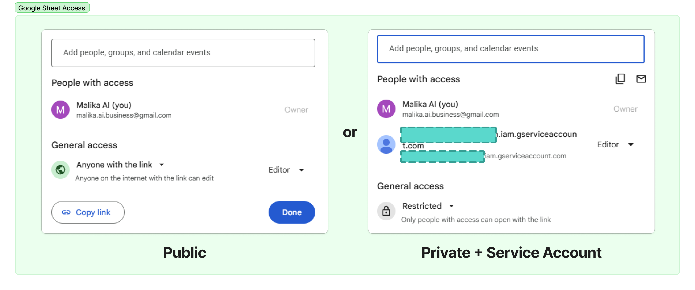

Akses Google Sheet

#### 6. Spreadsheet format, not XLSX

Pastiin format yang dipakai adalah Spreadsheet, bukan XLSX. Biasanya, tulisan "XLSX" tampak di samping kanan nama Google Sheet, yang mana hal tersebut tidak ada apabila formatnya sudah benar.

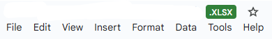

Format XLSX

#### 7. (Optional but Recommended): Use `IMPORTRANGE` to clone the original worksheet

Buatlah _worksheet_ baru dan lakukan `IMPORTRANGE` data asli, lalu ubah data agar sesuai format di atas biar ga ngubah data asli milik klien

<Aside>

#### Google Sheet Format Example
Berikut adalah contoh data Google Sheet yang udah sesuai format dan yang tidak sesuai format.

<a href="https://docs.google.com/spreadsheets/d/1EqEzhvyO4F5dtmPtX77kZqFgQgsqxuArNh3b8AUbywk" target="_blank"><b>👉 Contoh Format Google Sheet 👈</b></a>
</Aside>

### Clone and Create New Profile/Webhook

Setelah data Google Sheet dah dibuat format sesuai dengan yang udah dibahas di [Data Preparation](#data-preparation), kamu bisa mulai gabungin data Google Sheet ke Malika Tools dengan membuat _profile_ Google Sheet baru di Malika Tools. Nantinya, _profile_ yang dibuat akan membuat _webhook_ baru yang bisa diakses sama si Cekat AI, dengan langkah-langkah berikut:

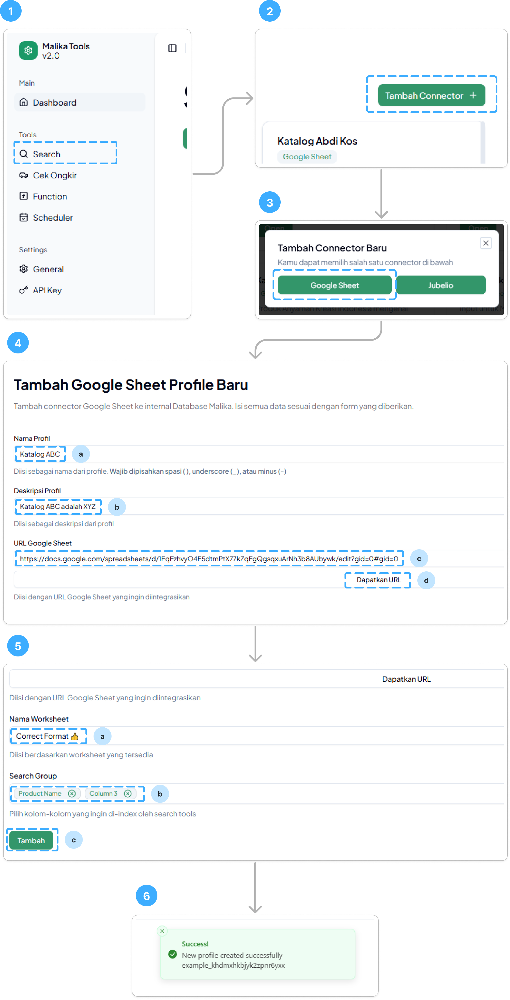

Alur Membuat _Profile_ Baru (Google Sheet)

1. Buka https://tools.malika.ai lalu navigasi ke Tools > Search
2. Klik tombol "Tambah Connector" di sebelah kanan
3. Pilih Google Sheet untuk profil yang akan dibuat
4. Isi parameter Nama Profil (a), Deskripsi Profil (b), dan URL Google Sheet (c). Pastikan URL Google Sheet adalah link yang valid agar tidak error. Apabila valid, maka klik tombol "Dapatkan URL" (d) untuk mendapatkan informasi _worksheet_ dan kolom dari data Google Sheet

<Aside type="caution">

#### Naming the Profile

Format nama yang diperbolehkan ketika ingin membuat profile _webhook_ hanya boleh dipisah menggunakan spasi, underscore (`_`), atau strip (`-`).

Contoh:
- katalog_malika_ai ✅
- KATALOG MALIKA AI ✅
- Katalog-Malika-AI ✅
- Katalog@Malika@AI ❌
- Katalog (Malika AI) ❌

</Aside>

5. Pilih _worksheet_ yang ingin diintegrasi dan search group yang relevan. Search group adalah kolom-kolom mana yang akan diperhitungkan selama proses pencarian berlangsung. Apabila semua sudah diisi, maka klik tombol "Tambah"
6. Apabila berhasil, maka akan muncul pesan notifikasi sukses di bagian atas Malika Tools

Profil yang dibuat tersebut di balik layar sebenernya ngebuat _webhook_ untuk data yang dah berhasil kamu tambah. So, kamu bisa daftarin _webhook_ itu di tools-nya Cekat AI bagian Integrations.

<Aside type="caution">

##### 1 Worksheet = 1 Profile/Webhook!

Perlu digarisbawahi bahwa setiap 1 _worksheet_ akan berisi pas 1 tabel. 1 profil/_webhook_ yang didaftarkan di Malika Tools hanya bisa menampung 1 tabel saja. Jadi kalo data klien memiliki n jumlah _worksheet_, maka kalian haru membuat n jumlah profil/_webhook_ juga.

</Aside>

### Register the Newly Created Webhook to Cekat AI

Setelah udah buat profil baru (berupa _webhook_) untuk Google Sheet di Malika Tools yang dah dibahas di [Clone and Create New Profile/Webhook](/#clone-and-create-new-profilewebhook), kamu bisa daftarin profil baru itu di tools Cekat AI di menu Integrations milik AI Agent.

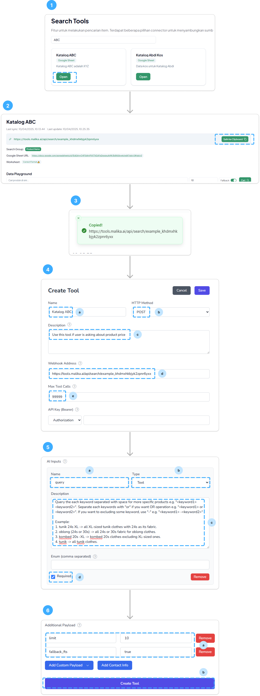

Alur Mendaftarkan _Webhook_ Malika Tools ke Cekat AI

1. Buka profil yang sudah dibuat tadi 
2. Klik tombol "Salin ke Clipboard"
3. Pastikan terdapat notifikasi bahwa proses _copy_ berhasil
4. Tambahkan tools baru di Cekat AI, lalu isi input yang tersedia \
  a. Name ➡️ Bebas \
  b. HTTP Method ➡️ Pilih `POST` \
  c. Description ➡️ Buat deskripsi tentang kapan tools yang dibuat akan di-_trigger_ oleh si AI melalui percakapan dengan _customer_. _Better to use english instead_ \
  d. Webhook Address ➡️ Isi dengan URL yang sudah di-_copy_ dari Malika Tools \
  e. Max Tool Calls ➡️ Buat yang lebih banyak dari 30, misal `99999`
5. Isi AI Inputs dengan data input _webhook_ yang nilai kita mau dinamis ditentuin dari AI-nya \
  a. Name ➡️ `query` \
  b. Type ➡️ `Text` \
  c. Description ➡️ Sebenernya bebas, tapi _better_ diisi seperti yang di gambar dengan konteks `Example` yang disesuaiin. Format _keyword_ pencarian dari `query` dapat dilihat di [Delve More about Search feature](#delve-more-about-search-feature)
6. Isi Additional Payload dengan data input _webhook_ yang nilainya cukup dengan nilai statis \
  a. `limit` (Wajib) dan `fallback_fts` (Opsional)
  b. Klik tombol "Create Tool" untuk membuat tools baru di Cekat AI

### Delve More about Search feature

Apabila kalian membuat profil baru di Malika Tools, yang terjadi sebenarnya adalah Malika Tools membuatkan sebuah _webhook_ API agar bisa dipanggil oleh tools yang ada di Cekat AI. Seperti pada _webhook_ biasanya, _webhook_ yang dibuat sama si Malika Tools ini memiliki dua nilai penting: 

1. _**URL Address**_ ➡️ berfungsi sebagai "alamat" yang diberikan Cekat AI spesifik untuk tools tersebut. Biasnya berisi URL dengan isi seperti `https://tools.malika.ai/api/search/nama-profile`
2. _**Request Body**_ ➡️ Input yang dibutuhkan _webhook_ untuk memproses pencarian. Input ini nantinya didaftarkan di tools Cekat AI pada segmen AI Inputs dan Additional Payload.

_Request body_ yang tersedia untuk _webhook_ pada fitur Search ini ada 4, di mana 2 wajib dan 2 lainnya opsional.

##### 1. `query` (Wajib)
Berisi keyword pencarian untuk mendapatkan item tertentu yang relevan. Pencarian akan mencari berdasar kolom-kolom yang ter-_include_ di _search group_. Punya format khusus buat nyari data biar lebih fleksibel sebagai berikut.
- Apit keyword yang memiliki lebih dari dua kata pake **tanda petik satu** `''` , misal `'kombed 30s'`
- Pisahin setiap _keyword_ pencarian pake **spasi** untuk pencarian yang lebih spesifik (logika `AND`), misal `tunik XL 'kombed 30s'` maka akan menghasilkan semua data baju berbahan Kombed 30s, tipe Tunik, dengan ukuran XL
- Pisahin setiap keyword pencarian pake **`or`** untuk pencarian dengan kondisi `OR`, misal `tunik XL or tunik S` maka akan menghasilkan semua data baju Tunik untuk ukuran XL atau S
- Kasih tanda strip **`-`** persis sebelum _keyword_ untuk mengecualikan _keyword_ tersebut dalam pencarian, misal `tunik -L -M` maka menghasilkan semua daat baju Tunik, tapi selain ukuran L dan M

##### 2. `limit` (Wajib)
Nilai `limit` adalah jumlah data maksimum yang dikembaliin si Malika Tools ke Cekat AI. Di tools sebelumnya, variabel `limit` bernama `num_data`.

##### 3. `fallback_fts` (Opsional, _default_-nya `true`)
Algoritma pencarian yang digunakan di Malika Tools versi baru ini pakai dua jenis: pencarian `exact` menggunakan FTS (Full-Text Search) dan pencarian `fuzzy`. Pencarian `exact` akan mencari data secara eksak, alias apabila query yang diberikan tidak ada yang match dengan data, maka hasilnya akan kosong, yang mana berbeda dengan `fuzzy` di mana akan tetap dikembalikan hasilnya dengan mengurutkan nilai `similarity` dari query yang diberikan.

_By default_, algoritma yang digunakan adalah **_exact_** atau **FTS**. Apabila hasil tidak ada yang match, maka akan di-_fallback_ atau di-_backup_ menggunakan algoritma _fuzzy_ agar tetap mendapatkan hasil yang paling dekat. Jika `fallback_fts` dimatikan (atau dibuat `false`), maka pencarian akan lebih `strict` dan terdapat kemungkinan menghasilkan nilai kosong.

##### 4. `sort_by` (Opsional, _default_-nya kolom pertama dari tabel)

Digunakan untuk menentukan data yang ditampilkan akan diurutkan berdasarkan kolom apa. Usahakan nama kolom ditulis persis--tanpa typo dengan yang ada di Google Sheet milik klien.

##### 5. `order` (Opsional, _default_-nya `asc`)

Biasanya kerja bareng `sort_by`, apakah diurutkan dalam urutan menaik/_ascending_ (`asc`) atau menurun/_descending_ (`desc`)

Biar gak bingung, mimin kasih contoh salah satu klien yang pake semua inputnya, yang mana input `query` dibuat di AI Inputs, sedangkan sisanya dibuat di Additional Payload. 

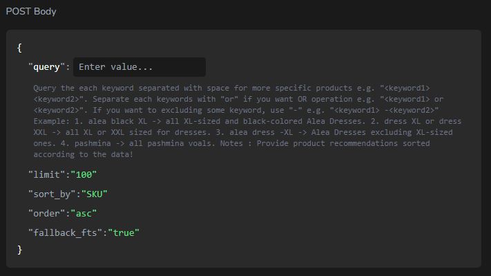

Contoh Input yang Bisa Dipakai _Webhook_

### Data Syncing

Seperti yang udah dijelasin, mekanisme Malika Tools yang baru ini adalah melakukan kloning data mentah klien ke database internal Malika, lalu proses pencarian yang dilakuin di Cekat akan ditembak langsung ke database internal Malika alih-alih langsung ke data mentah klien. Untuk itu, **WAJIB HUKUMNYA** melakukan proses sinkronisasi data di Malika Tools untuk mendapatkan data yang selalu _update_ dari data asli klien.

Terdapat dua cara untuk melakukan ini, yaitu secara langsung di dalam dashboard https://tools.malika.ai atau menggunakan trigger eksternal milik https://tools.malika.ai

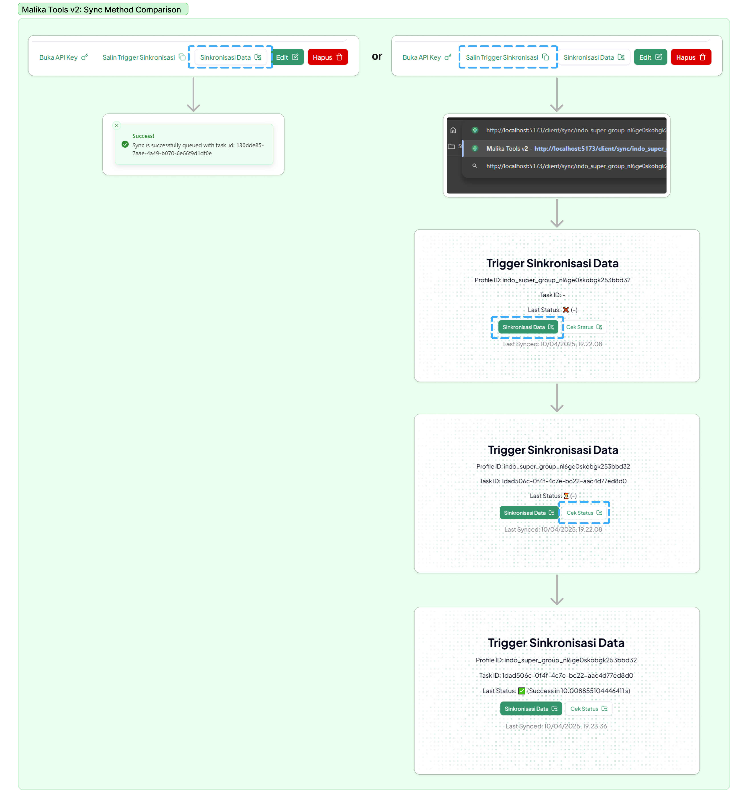

Perbandingan Metoed Sinkronisasi Data

#### 1. Directly from dashboard

Kamu bisa melakukan sinkron menggunakan tombol "Sinkronisasi Data" di bawah saat membuka salah satu profil di Malika Tools

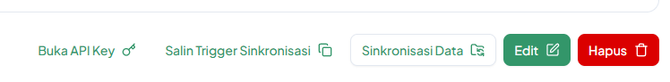

Sinkronisasi via Dashboard

Untuk melihat apakah proses sinkronisasi berhasil atau tidak, coba _refresh_ web browser kamu dan lihat tulisan "Last sync: xxx" di bawah nama profil apakah sudah berganti atau belum.

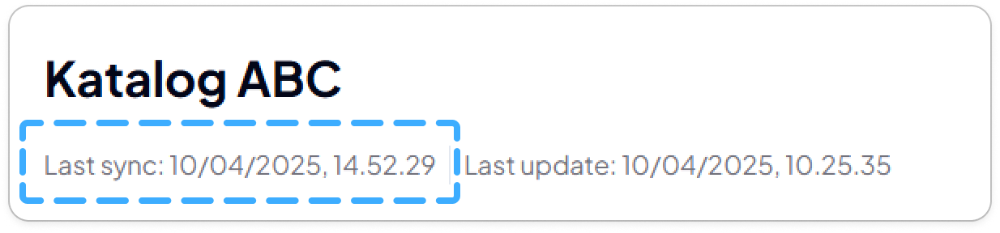

Informasi Tanggal Sinkronisasi Terakhir

#### 2. Using external trigger created from dashboard

Kamu bisa klik tombol "Salin Trigger Sinkronisasi" lalu kamu bakal ndapetin link URL baru. Setelah itu _paste_ link tersebut di web browser dan kamu akan melihat tampilan kurang lebih seperti di bawah.

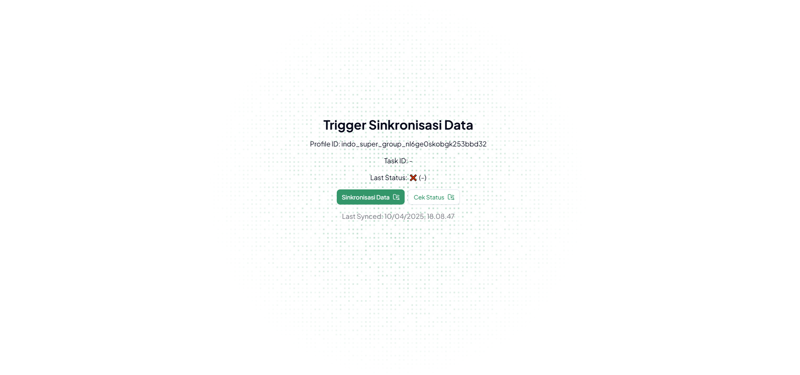

Trigger Sinkronisasi Eksternal

Klik tombol "Sinkronisasi Data" dan semuanya sama persis seperti saat sinkronisasi langsung di dashboard.

<Aside type="caution">

##### Occasionally Check the Status!

Proses sinkronisasi berjalan di server secara asinkron, jadi kamu perlu secara berkala untuk cek apakah proses sinkronisasi dengan `task_id` terkait sudah selesai apa belum. **JANGAN REFRESH sebelum status dari sinkronisasi berubah menjadi ✅.**

</Aside>

#### What's the Difference Between those Two?

Secara algoritma sinkronisasi sama aja, tapi sinkronisasi via dashboard harus memerlukan login terlebih dahulu. Hal tersebut gak ada di _trigger_ eksternal, yang mana bisa secara publik diakses oleh klien. Dengan begitu, klien dapat bisa secara partisipatif ikut ngesinkronin data mereka sendiri ketika ada perubahan.

### Search Playground

Kamu juga bisa ngetes apakah Search-nya bekerja dengan baik atau tidak di bagian Search Playground. Format-format yang sudah dijelaskan di [Delve More about Search feature](#delve-more-about-search-feature) juga berlaku di sini.

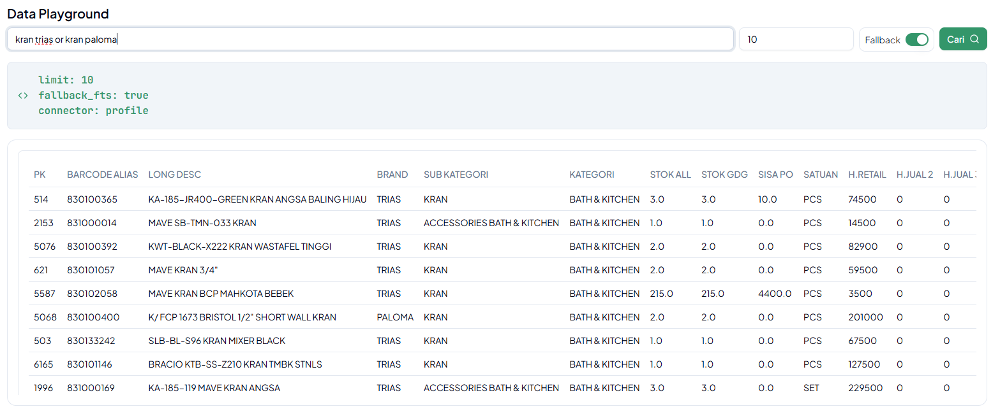

Search Playground Malika Tools

Kamu juga bisa melakukan tes pencarian data langsung dari Cekat AI melalui tools di menu Integration

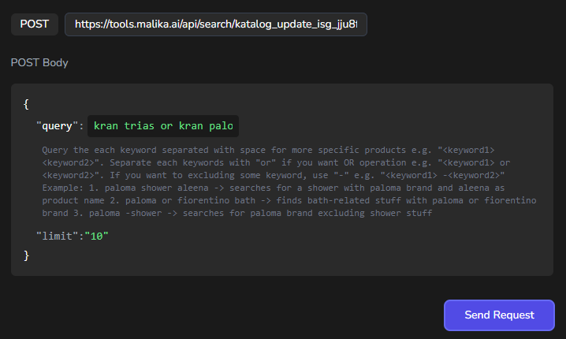

Search Playground Cekat AI

### Update and Delete

Kamu juga bisa mengubah informasi mengenai profil seperti nama, deskripsi, _worksheet_, atau _search group_ dengan menekan tombol "Edit". Di sini, kamu bisa mengganti nama dan deskripsi secara bebas tanpa harus ada _character restriction_, misal `Katalog Malika AI (v2)`.

Apabila tidak digunakan, kamu bisa menghapus profil dengan menekan tombol "Hapus" disamping tombol "Edit"

### Add Row

> On Development, Coming Soon ⚠️

## Jubelio

Selain _connector_ ke platform Google Sheet, Malika Tools juga nyediain _connector_ ke platform Jubelio juga lho! Untuk saat ini, _connector_ ini sudah bisa meng-_cover_ fitur pencarian data yang disimpan di Jubelio

### Credentials Preparation

Persiapan pertama sebelum memulai semuanya adalah kamu harus tanya klien apakah berkenan untuk membuatkan user baru dengan email punya Malika. Kalau mereka berkenan, simpan email dan password di tempat yang aman dulu ya.

### Clone and Create New Profile/Webhook

Langkahnya kurang lebih mirip sama pas ngebuat profil _webhook_ untuk Google Sheet, tapi ada sedikit perbedaan sebagai berikut.

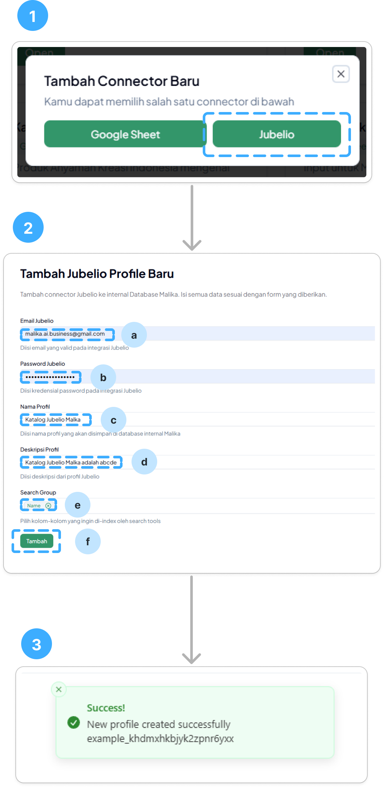

Alur Membuat _Profile_ Baru (Jubelio)

1. Memilih tipe Jubelio saat menekan tombol "Tambah Connector"
2. Isi Email Jubelio (a) dan Password Jubelio (b) dari kredensial yang diberi klien, lalu diikuti dengan Nama Profil (c), Deskripsi Profil (d), dan Search Group (e)
3. Pesan notifikasi akan muncul apabila proses penambahan berhasil

<Aside>
#### Naming the Profile

Format nama yang diperbolehkan ketika ingin membuat profile _webhook_ hanya boleh dipisah menggunakan spasi, underscore (`_`), atau strip (`-`).

Contoh:
- katalog_malika_ai ✅
- KATALOG MALIKA AI ✅
- Katalog-Malika-AI ✅
- Katalog@Malika@AI ❌
- Katalog (Malika AI) ❌

</Aside>

### Register the Newly Created Webhook to Cekat AI

Caranya sama persis dengan sebelumnya. Lihat [Register the Newly Created Webhook to Cekat AI (Google Sheet)](#register-the-newly-created-webhook-to-cekat-ai).

Bedanya, tambahkan Additional Payload `connector` dengan value `jubelio`, yang dah dicontohin seperti gambar di bawah.

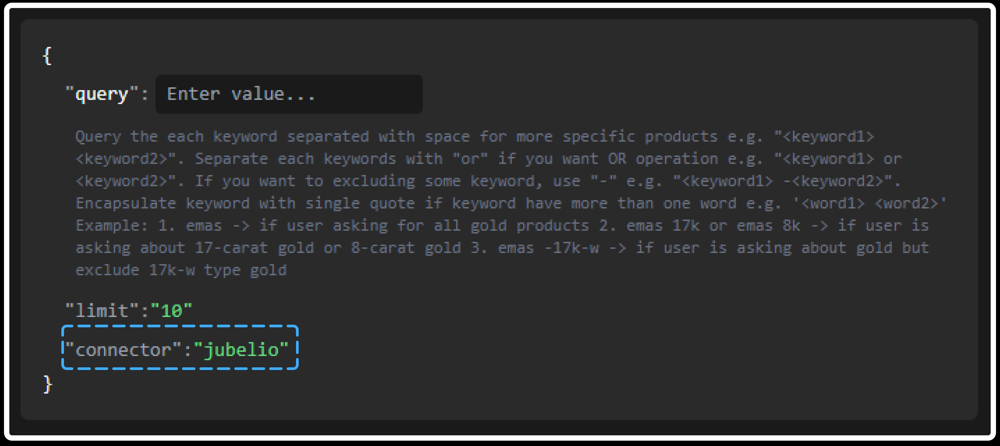

_Connector_ Jubelio

### Data Syncing

Caranya sama persis dengan sebelumnya. Lihat [Data Syncing (Google Sheet)](#data-syncing)

### Search Playground

Caranya sama persis dengan sebelumnya. Lihat [Search Playground (Google Sheet)](#search-playground)

### Update and Delete

Caranya sama persis dengan sebelumnya. Lihat [Update and Delete (Google Sheet)](#update-and-delete)

## Another Third Parties

Untuk saat ini, _connector_ yang bisa di-_support_ oleh Malika Tools baru dua: Google Sheet dan Jubelio. Kian hari, Malika Tools v2 akan terus dikembangkan biar bisa support sama banyak platform, seperti Accurate, Shopify, dan lain sebagainya. 

> Tools lebih beringas, jualan makin gassss, trainer tinggal kipas-kipas, letsgooo~ 🔥
